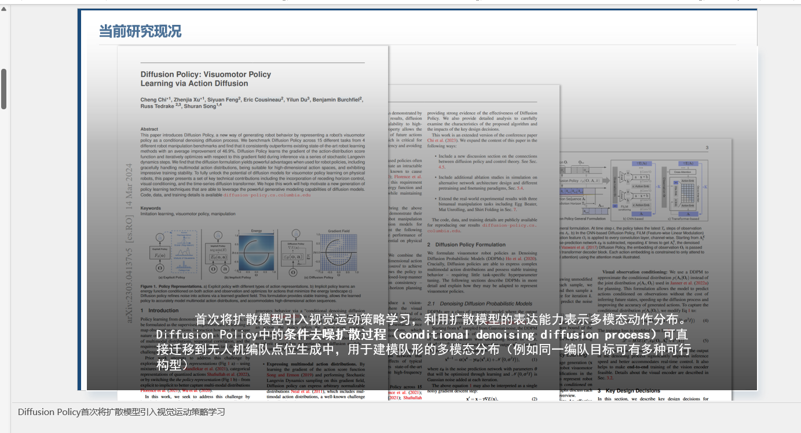
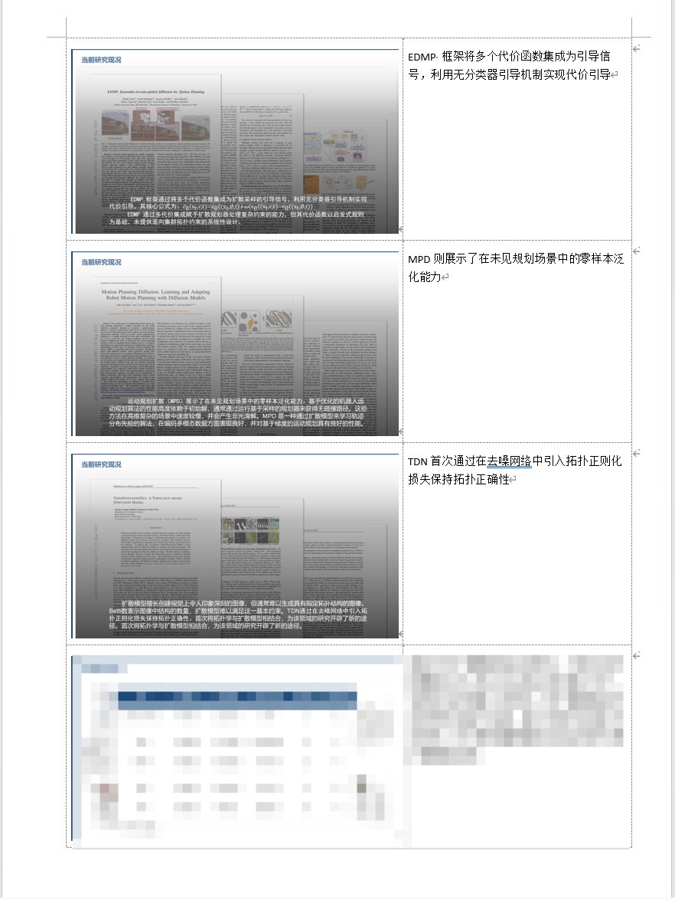

# PPTX → Word 讲义导出工具

将 PowerPoint 演示文稿导出为 Word 讲义文档（表格布局，幻灯片图片 + 演讲者备注）。





## 环境要求

| 组件 | 要求 |
|------|------|
| 操作系统 | Windows |
| Office | Microsoft PowerPoint + Microsoft Word（必须已安装） |
| Python | 3.10+ |
| 依赖包 | pywin32 |

## 快速开始

```powershell
# 1. 创建并激活虚拟环境
python -m venv .venv
.venv\Scripts\Activate.ps1

# 2. 安装依赖
pip install pywin32

# 3. 运行
python pptx_to_handouts.py "演示文稿.pptx"
```

## 使用方式

```bash
# === 常用场景 ===

# 默认：每页 3 张，横向，备注在右侧
python pptx_to_handouts.py "答辩.pptx"

# 每页 2 张，纵向
python pptx_to_handouts.py "答辩.pptx" --per-page 2 --orientation portrait

# 每页 4 张，纵向（紧凑排版）
python pptx_to_handouts.py "答辩.pptx" --per-page 4 --orientation portrait

# 每页 6 张，横向（适合快速浏览）
python pptx_to_handouts.py "答辩.pptx" --per-page 6

# === 进阶参数 ===

# 指定输出路径
python pptx_to_handouts.py "答辩.pptx" -o "C:\Output\讲义.docx"

# 高清导出（1920px 宽度）
python pptx_to_handouts.py "答辩.pptx" --slide-width 1920

# 增大备注列宽 + 中文字体 + 大字号
python pptx_to_handouts.py "答辩.pptx" --notes-width 3.5 --font-name "微软雅黑" --font-size 12

# === 调试模式 ===

# Word 前台可见，保留临时图片，打印详细日志
python pptx_to_handouts.py "答辩.pptx" --visible --keep-temp -v
```

## CLI 参数一览

| 参数 | 类型 | 默认值 | 说明 |
|------|------|--------|------|
| `input` | str | **必填** | 输入 PPTX / PPT 文件路径 |
| `-o` `--output` | str | 自动 | 输出 DOCX 路径。默认：输入同目录，文件名加 `_handouts` 后缀 |
| `--per-page` | int | `3` | 每页幻灯片数。可选：`1` `2` `3` `4` `6` `9` |
| `--orientation` | str | `landscape` | 页面方向：`portrait`（竖版） `landscape`（横版） |
| `--slide-width` | int | `1280` | 幻灯片导出 PNG 的宽度（像素）。高度自动按比例计算 |
| `--notes-width` | float | `2.8` | 备注列宽度（英寸） |
| `--slide-width-inch` | float | `6.2` | 幻灯片图片列宽度（英寸） |
| `--font-name` | str | `Calibri` | 备注文本字体名称 |
| `--font-size` | int | `10` | 备注文本字号（磅） |
| `--visible` | flag | — | Word 应用程序前台可见（调试用） |
| `--keep-temp` | flag | — | 保留临时导出的 PNG 文件（调试用） |
| `-v` `--verbose` | flag | — | 打印详细进度日志 |

## 布局说明

| `--per-page` | `--orientation` | 表格结构 | 典型页数（78 页 PPT） |
|-------------|----------------|---------|---------------------|
| 1 | landscape | 1 行 × 2 列（左图右备注） | 78 |
| 1 | portrait | 2 行 × 1 列（上图下备注） | 78 |
| 2 | landscape / portrait | 2 行 × 2 列 | 39 |
| 3 | landscape | 3 行 × 2 列 | 26 |
| 4 | portrait / landscape | 4 行 × 2 列 | 20 |
| 6 | landscape | 6 行 × 2 列 | 13 |
| 9 | landscape | 9 行 × 2 列 | 9 |

> 图片高度由脚本根据页面可用高度和每页张数自动计算，确保所有行不超出页面范围。

## 自定义默认配置

编辑 `pptx_to_handouts.py` 顶部 `HandoutConfig` 类的字段默认值：

```python
@dataclass
class HandoutConfig:
    per_page: int = 3          # 默认每页张数
    orientation: str = "landscape"
    slide_width_px: int = 1280 # PNG 导出分辨率
    slide_col_width_inch: float = 6.2
    notes_col_width_inch: float = 2.8
    font_name: str = "Calibri"
    font_size: int = 10
    margin_top: float = 0.5
    margin_bottom: float = 0.5
    margin_left: float = 0.8
    margin_right: float = 0.5
```

修改后保存，后续运行无需重复传参。

## 代码架构

```
pptx_to_handouts.py
├── HandoutConfig         # 配置 dataclass（用户可修改默认值）
├── PPTExtractor          # PowerPoint COM 封装：导出 PNG、提取备注
├── WordAssembler         # Word COM 封装：创建表格、插入图片/文字
├── build_handouts()      # 主编排函数：串联全流程
└── main()                # CLI 入口：argparse 参数解析
```

## 故障排查

### 1. COM 连接失败

```
无法连接 Microsoft Office COM 接口
```

- 确认已安装 Microsoft PowerPoint 和 Microsoft Word
- 以管理员身份运行：
  ```powershell
  & ".venv\Scripts\python.exe" "Scripts\pywin32_postinstall.py" -install
  ```

### 2. 残留 Office 进程

脚本内置 `try/finally` 进程守护，异常退出也会自动清理 PowerPoint 和 Word 进程。如果仍有残留：

```powershell
Get-Process -Name "POWERPNT","WINWORD" -ErrorAction SilentlyContinue | Stop-Process -Force
```

### 3. 幻灯片导出失败 (RPC_E_CALL_REJECTED)

脚本内置 0.5s 幻灯片间延迟 + 指数退避重试（最多 3 次），通常无需额外处理。如果大量失败，可检查目标 PPTX 是否含有损坏的嵌入对象。

### 4. 中文备注乱码

Word 中打开 DOCX 后，选择备注文本并手动设置字体为"微软雅黑"或"宋体"。或运行时指定：
```bash
python pptx_to_handouts.py "答辩.pptx" --font-name "微软雅黑"
```

## 项目结构

```
pptx-to-handouts/
├── .venv/                  # Python 虚拟环境
├── pptx_to_handouts.py     # 主脚本（单文件，约 850 行）
└── README.md               # 本说明文件
```

---

**修改日志**: v1.1 — 修复分页符导致空白页问题；增加图片高度约束确保每页幻灯片数正确；取消 per_page>=3 的强制横版限制；补充完整 README 文档
